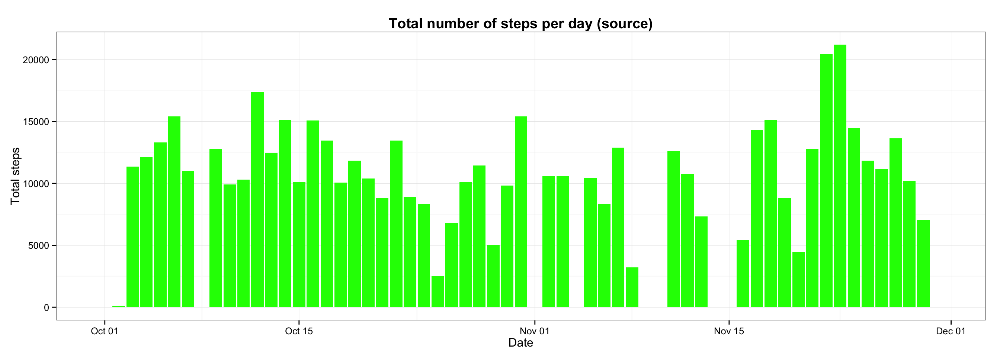
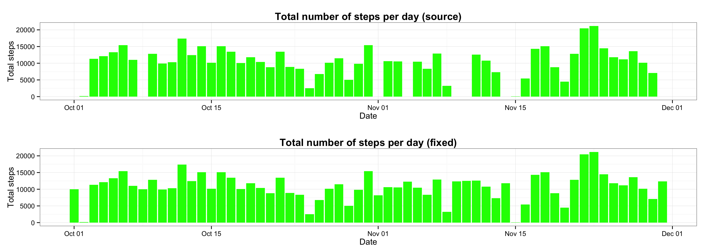
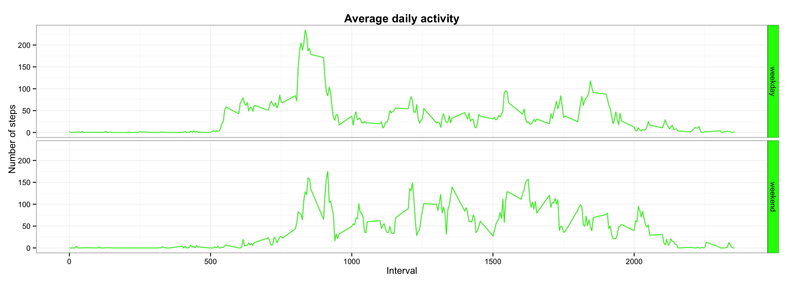

## Reproducible Research - Peer Assessment 1: Activity Monitoring

##Introduction

It is now possible to collect a large amount of data about personal movement using activity monitoring devices such as a [Fitbit](http://www.fitbit.com), [Nike
                                                                                                                                                           Fuelband](http://www.nike.com/us/en_us/c/nikeplus-fuelband), or
[Jawbone Up](https://jawbone.com/up). These type of devices are part of the “quantified self” movement – a group of enthusiasts who take measurements about themselves regularly to improve their health, to find patterns in their behavior, or because they are tech geeks. But these data remain under-utilized both because the raw data are hard to obtain and there is a lack of statistical methods and software for processing and interpreting the data.

This assignment makes use of data from a personal activity monitoring device. This device collects data at 5 minute intervals through out the day. The data consists of two months of data from an anonymous individual collected during the months of October and November, 2012 and include the number of steps taken in 5 minute intervals each day.

## Loading and preprocessing the data

To begin this study, user should load libraries: ggplot, gridExtra and dplyr 
which could be done using:
        
        1. install.packages("ggplots")
2. install.packages("plyr"). 
3. install.packages("dplyr"). 
4. install.packages("gridExtra")

manualy on users machine.

```{r libraries, echo=TRUE}
# load needed libraries
library(gridExtra)
library(ggplot2)
library(plyr)
library(dplyr)

```

The data for this assignment can be downloaded from the course web site:
        
        https://d396qusza40orc.cloudfront.net/repdata%2Fdata%2Factivity.zip

Loading data:
        
        ```{r loadingdata, echo=TRUE}
# set working directory
fileName = "activity.zip"
# download file
if (!file.exists(fileName)) 
{
        retval = download.file("https://d396qusza40orc.cloudfront.net/repdata%2Fdata%2Factivity.zip",
                               destfile="activity.zip",
                               method = "curl")
        unzip("activity.zip")
}
# read file using read.csv
activityData <- read.csv("activity.csv", header=TRUE, sep=",", )
# convert date column from factor to Date class
activityData$date<-as.Date(activityData$date)
# provide a summary of the activityData table
summary(activityData)
```

### Total number of steps taken per day

Calculate the table with the total number of steps taken each day, ignoring the missing values. 

### Creating the date field as Date type

```{r stepsperday, echo=TRUE}
stepsperday <- activityData %>% group_by(date) %>% summarise(total.steps = sum(steps, na.rm = T))
print(stepsperday)
# Creating the date field as Date type
stepsperday$date <- as.Date(stepsperday$date, "%Y-%m-%d")
```

### Calculating the mean and median total number of steps taken per day.  

```{r calcmean_median}
# Define total mean of steps sums for each day
Mean.steps <- round(mean(stepsperday$total.steps))
print(Mean.steps)
# Define total median of steps sums for each day
Median.steps <- median(stepsperday$total.steps)
print(Median.steps)
```

## Histogram of the total number of steps per each day.  

```{r hstepsperdayhistogram, fig.width=14}
g1 <- ggplot(stepsperday, 
             aes(x=date, 
                 y=total.steps))
g1 <- g1 + geom_bar(fill="green", stat="identity")
g1 <- g1 + theme_bw()
g1 <- g1 + labs(x = "Date", size=10) 
g1 <- g1 + labs(y = "Total steps", size=10) 
g1 <- g1 + labs(title="Total number of steps per day (source)")
g1 <- g1 + theme(plot.title = element_text(lineheight=1, face="bold"))
print(g1)
```

 

## What is the average daily activity pattern?
Calculate the table with the average number of steps taken each 5-minute interval, ignoring the missing values.  
```{r calcstepsperinterval}
stepsperinterval <- ddply(activityData,.(interval), summarize, avg.steps=mean(steps, na.rm=TRUE))
```

## Time series plot of the 5-minute interval and the average number of steps taken, averaged across all days.

```{r stepsperinterval.plot, fig.width=14}
g <- ggplot(stepsperinterval, aes(x=interval, y=avg.steps))
g <- g + geom_line()
g <- g + theme_bw()
g <- g + labs(x = "Interval") 
g <- g + labs(y = "Average number of steps taken") 
g <- g + labs(title="Average daily activity")
g <- g + theme(plot.title = element_text(lineheight=1, face="bold"))
print(g)
```
 

## Which 5-minute interval, on average across all the days in the dataset, contains the maximum number of steps?

```{r maxnrsteps}
maxnrsteps <- stepsperinterval$interval[which.max(stepsperinterval$avg.steps)]
maxnrsteps
```

## Imputing missing values

### Calculating the total number or missing values in the dataset.  
```{r missvalues}
mis <- aggregate(cnt~date,cbind(activityData[is.na(activityData$steps),],cnt=c(1)),sum,na.rm = FALSE)
mis$dow <- weekdays(as.Date(mis$date),abbreviate=TRUE)
print(mis[,c(1,3,2)])
```

### Imput missing values

```{r imputmissvalues, ECHO = true}
activityData$datetime <- as.POSIXct(
        with(
                activityData,
                paste(
                        date,
                        paste(interval %/% 100, interval %% 100, sep=":"))
        ),
        format="%Y-%m-%d %H:%M",tz="")
ref_ds <- aggregate(steps~interval+weekdays(datetime,abbreviate=TRUE),activityData,FUN=mean,na.rm=TRUE)
colnames(ref_ds) <- c("interval","dow","avg_steps")
ref_ds$dow <- factor(ref_ds$dow,levels = c("Mon","Tue","Wed","Thu","Fri","Sat","Sun"))
#ggplot(ref_ds,aes(x=interval,y=avg_steps)) + geom_line() + facet_grid("dow ~ .")
activityData$dow <- weekdays(activityData$datetime,abbreviate=TRUE)
af <- merge(activityData,ref_ds,by=c("dow","interval"),all.x = TRUE)
af <- af[with(af,order(date,interval)),]
af$fixed_steps <- ifelse(is.na(af$steps),af$avg_steps,af$steps)
```

### Calculating data set for histogram

```{r datasethist, ECHO = true}
stepsPerDay2 <- setNames(aggregate(fixed_steps~as.Date(date),af,sum,na.rm = TRUE),c("date","steps"))
```

### Plotting histogram

```{r histplotimput, fig.width=14}
g2 <- ggplot(stepsPerDay2,aes(x=date,y=steps))
g2 <- g2 + geom_bar(fill="green", stat="identity") 
g2 <- g2 + theme_bw()
g2 <- g2 + labs(x = "Date", size=10) 
g2 <- g2 + labs(y = "Total steps", size=10) 
g2 <- g2 + ggtitle("Total number of steps per day (fixed)")
g2 <- g2 + theme(plot.title = element_text(lineheight=1, face="bold"))
## combining with previous
grid.arrange(g1, g2, nrow=2)
```


## Are there differences in activity patterns between weekdays and weekends?

We already saw that day of week patterns differs for original data set. Not let’s look at differneces in patterns for working days and weekends.

```{r weekdiffdaysends, ECHO = true} 
week_diff <- aggregate(
        steps~dow+interval,  # group steps by weekend/weekday and interval to find average steps 
        with(activityData,data.frame(dow = factor(
                ifelse(
                        weekdays(as.Date(date)) %in% c("Sunday","Saturday"),
                        "weekend",  # if sunday or saturday
                        "weekday"   # else
                )),interval,steps)),FUN = mean,rm.na = TRUE)
```

### Plotting result

```{r histweekdiff, ECHO = true, fig.width=14}
g <- ggplot(week_diff,aes(x=interval,y=steps)) 
g <- g + theme_bw()
g <- g + facet_grid("dow ~ .")
g <- g + geom_line(colour="green")
g <- g + labs(x = "Interval") 
g <- g + labs(y = "Number of steps") 
g <- g + labs(title="Average daily activity")
g <- g + theme(plot.title = element_text(lineheight=1, face="bold"),
               strip.text.x = element_text(size=10),
               strip.background = element_rect(colour="black",fill="green"))
print(g)
```

